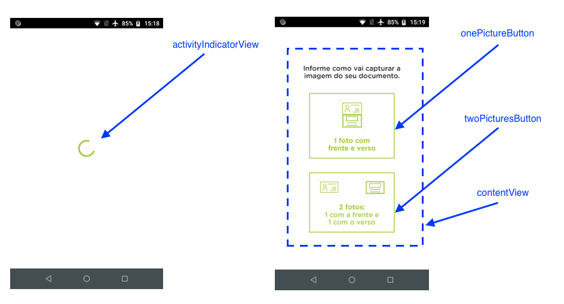
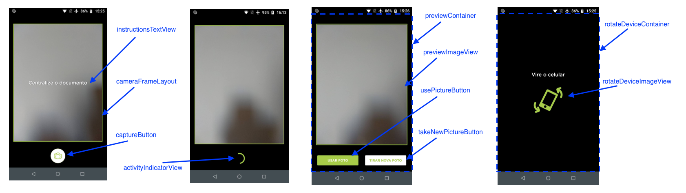
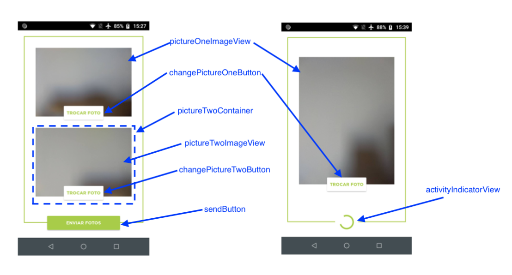

# Documentoscopia - Guia de implementação de view customizada

Além de poder usar o SDK em sua forma padrão de exibição, o SDK permite que a forma de visualização seja completamente customizada.

## Entendendo o funcionamento

O componente de Documentoscopia é dividido em três telas:

1. Tela inicial, onde o usuário deve escolhar se irá capturar apenas uma foto (com frente e verso) ou duas fotos (uma da frente e outra do verso)
2. Tela de captura das imagens, onde o usuário irá fotografar o documento.
3. Tela de confirmação, onde o usuário poderá confirmar se as fotos estão boas, e em caso negativo, poderá capturá-las novamente.

De forma semelhante ao Liveness, a customização do visual é feita através da implementação dos layouts (XMLs), os quais devem obrigatoriamente conter alguns elementos visuais com IDs pré-determinados, para o correto funcionamento do processo de documentoscopia. A diferença é que, neste caso, deve-se implementar 3 layouts, sendo um para cada tela citada anteriormente.

#### 1. Tela inicial

Para a tela inicial, deve-se passar o xml do layout através do parâmetro `DocumentscopyActivity.PARAM_CUSTOM_HOME_FRAGMENT`.

O layout fornecido deve conter as seguintes views:

|Classe|id|Obrigatória|Descrição|
|------|--|-----------|---------|
|View|activityIndicatorView|Sim|View que será exibida em momentos de carregamento e validação.|
|View|onePictureButton|Sim|View clicável para usuário selecionar opção de apenas uma foto.|
|View|twoPicturesButton|Sim|View clicável para usuário selecionar opção de duas fotos.|
|View|contentView|Sim|ViewGroup que deve englobar todas as outras views, com exceção de activityIndicatorView.|

Na figura abaixo é possível visualizar o que cada uma das subviews representa na tela:

#### 2. Tela de captura

Para a tela de captura, deve-se passar o xml do layout através do parâmetro `DocumentscopyActivity.PARAM_CUSTOM_CAMERA_FRAGMENT`.

O layout fornecido deve conter as seguintes views:

|Classe|id|Obrigatória|Descrição|
|------|--|-----------|---------|
|TextView|instructionsTextView|Sim|Texto informativo com orientação da captura, é exibido por apenas alguns segundos.|
|FrameLayout|cameraFrameLayout|Sim|Nesta view será colocado o preview da câmera.|
|View|captureButton|Sim|Botão para capturar foto.|
|View|activityIndicatorView|Sim|View que será exibida após o clique para capturar a imagem, enquanto a câmera processa.|
|ViewGroup|previewContainer|Sim|ViewGroup que será exibido após a captura de uma imagem.|
|ImageView|previewImageView|Sim|ImageView onde será exibida a imagem capturada para o usuário confirmar se ficou boa.|
|View|usePictureButton|Sim|Botão para que o usuário confirme a foto capturada.|
|View|takeNewPictureButton|Sim|Botão para que o usuário capture a foto novamente.|
|ViewGroup|rotateDeviceContainer|Sim|ViewGroup exibido quando o celular não estiver na orientação correta*.|
|ImageView|rotateDeviceImageView|Não|Esta ImageView conterá uma animação de rotação.|

\* Na opção de foto única, o aparelho precisa estar na posição vertical/retrato para a captura das imagens, e, na opção de duas fotos, deverá estar na posição horizontal/paisagem. Caso o aparelho esteja na orientação errada, a view `rotateDeviceContainer` será exibida, orientando o usuário a rotacionar o aparelho.

Na figura abaixo é possível visualizar o que cada uma das subviews representa na tela:

Para esta tela também é possível especificar os textos que serão exibidos no `instructionsTextView`. Para isto, utilize os seguintes parâmetros: `DocumentscopyActivity.PARAM_CUSTOM_CAM_INSTRUCTION_SINGLE`, `DocumentscopyActivity.PARAM_CUSTOM_CAM_INSTRUCTION_FRONT` e `DocumentscopyActivity.PARAM_CUSTOM_CAM_INSTRUCTION_BACK`.

#### 3. Tela de confirmação

Para a tela de confirmação, deve-se passar o xml do layout através do parâmetro `DocumentscopyActivity.PARAM_CUSTOM_CONFIRMATION_FRAGMENT`.

O layout fornecido deve conter as seguintes views:

|Classe|id|Obrigatória|Descrição|
|------|--|-----------|---------|
|ImageView|pictureOneImageView|Sim|ImageView para exibir a frente do documento, ou o documento completo, caso tenha sido escolhida a opção de foto única.|
|View|changePictureOneButton|Sim|Botão para trocar a imagem da frente do documento, ou o documento completo, caso tenha sido escolhida a opção de foto única.|
|ViewGroup|pictureTwoContainer|Sim|Container para exibir o verso do documento*.|
|ImageView|pictureTwoImageView|Sim|ImageView para exibir o verso do documento.|
|View|changePictureTwoButton|Sim|Botão para trocar a imagem do verso do documento.|
|View|sendButton|Sim|Botão para realizar o envio do documento.|
|View|activityIndicatorView|Sim|View que será exibida após clicar no sendButton, enquanto a requisição é feita.|

\* Caso tenha sido escolhida a opção de foto única, a view `pictureTwoContainer` terá sua visibilidade como GONE.

Na figura abaixo é possível visualizar o que cada uma das subviews representa na tela:

# Observações

Caso algum dos fragment não estejam em conformidade com as especificações, será retornado o erro `INVALID_CUSTOM_FRAGMENT` no `onActivityResult` (através da chave `DocumentscopyActivity.PARAM_RESULT_ERROR`). Para saber mais detalhes sobre a causa do erro, é possível verificar o valor retornado em `DocumentscopyActivity.PARAM_RESULT_ERROR`.

As subviews podem ser de classes que extendam as classes descritas nas tabela acimas. Por exemplo, sendButton pode ser da classe Button.

Além das subviews especificadas, as views customizadas pode conter outros elementos, apenas tomando cuidado para que os mesmos não interfiram nas subviews funcionais.

No projeto Sample, neste mesmo repositório, encontra-se um exemplo de implementação. Recomenda-se usar como ponto de partida os layouts inclusos neste sample, modificando-os de acordo com a necessidade.
