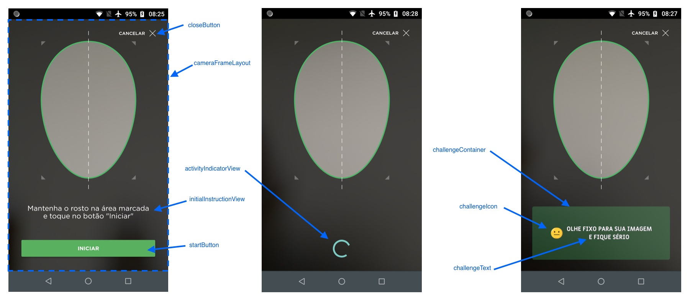

# Liveness - Guia de implementação de view customizada

A partir da versão 2.0.0, o SDK Liveness permite que a forma de visualização seja completamente customizada.

Para isso, é necessário criar um layout que será utilizado pelo fragment do SDK, e passá-lo para o Intent da `FaceCaptchaActivity`, através da chave `PARAM_OVERLAY_IMAGE`. Este fragment deve obrigatoriamente conter alguns elementos visuais do IDs pré-determinados, para o correto funcionamento do processo de desafios.

Caso este fragment não esteja em conformidade com as especificações, será retornado o erro `INVALID_CUSTOM_FRAGMENT` no `onActivityResult` (através da chave `FaceCaptchaActivity.PARAM_RESULT_ERROR`). Para saber mais detalhes sobre a causa do erro, é possível verificar o valor retornado em `FaceCaptchaActivity.PARAM_RESULT_ERROR`.

```swift
/// Protocolo que deve ser implementado pela view customizada
public protocol FCView: UIView {

    // MARK: - Views obrigatórias

    /// UIButton para iniciar o desafio
    var startButton: UIButton! { get }
    /// UIButton para interromper e fechar o desafio
    var closeButton: UIButton! { get }
    /// UIView que será exibida em momentos de carregamento e validação
    var activityIndicatorView: UIView! { get }
    /// UIImageView que exibirá o ícone do desafio
    var challengeIcon: UIImageView! { get }
    /// UIImageView que exibirá o texto do desafio
    var challengeText: UIImageView! { get }

    // MARK: - Views opcionais

    /// Opcional: UIView usada como container de challengeIcon e challengeTextView
    var challengeContainer: UIView? { get }
    /// Opcional: UIView que será mostrada inicialmente, e desaparece após startButton ser clicado
    var initialInstructionView: UIView? { get }
}
```

Alguns destes atributos são opcionais, não sendo necessários para o funcionamento correto do processo de desafios.

Além das subviews especificadas, a view customizada pode conter outros elementos, apenas tomando cuidado para que os mesmos não interfiram nas subviews funcionais.

Na figura abaixo é possível visualizar o que cada uma das subviews representa na tela:



Após criado o layout, é necessário passá-lo para o Intent da `FaceCaptchaActivity`, através da chave `PARAM_CUSTOM_FRAGMENT`. Exemplo:

```kotlin
val intent = Intent(this, FaceCaptchaActivity::class.java).apply {
    putExtra(FaceCaptchaActivity.PARAM_ENDPOINT, ENDPOINT)
    putExtra(FaceCaptchaActivity.PARAM_USER_DATA, userData)
    putExtra(FaceCaptchaActivity.PARAM_DEBUG_ON, false) // Passar true para mostrar logs na tela
    putExtra(FaceCaptchaActivity.PARAM_CUSTOM_FRAGMENT, R.layout.fragment_custom)
}
```

No projeto Sample, neste mesmo repositório, encontra-se um exemplo de implementação.
